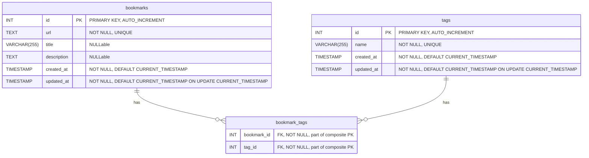

# ER図

```mermaid
erDiagram
    bookmarks {
        INT id PK "PRIMARY KEY, AUTO_INCREMENT"
        TEXT url "NOT NULL, UNIQUE"
        VARCHAR(255) title "NULLable"
        TEXT description "NULLable"
        TIMESTAMP created_at "NOT NULL, DEFAULT CURRENT_TIMESTAMP"
        TIMESTAMP updated_at "NOT NULL, DEFAULT CURRENT_TIMESTAMP ON UPDATE CURRENT_TIMESTAMP"
    }

    tags {
        INT id PK "PRIMARY KEY, AUTO_INCREMENT"
        VARCHAR(255) name "NOT NULL, UNIQUE"
        TIMESTAMP created_at "NOT NULL, DEFAULT CURRENT_TIMESTAMP"
        TIMESTAMP updated_at "NOT NULL, DEFAULT CURRENT_TIMESTAMP ON UPDATE CURRENT_TIMESTAMP"
    }

    bookmark_tags {
        INT bookmark_id "FK, NOT NULL, part of composite PK"
        INT tag_id "FK, NOT NULL, part of composite PK"
    }

    bookmarks ||--o{ bookmark_tags : "has"
    tags      ||--o{ bookmark_tags : "has"
```
