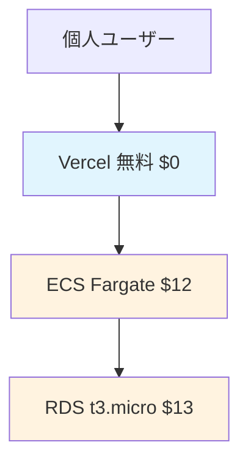
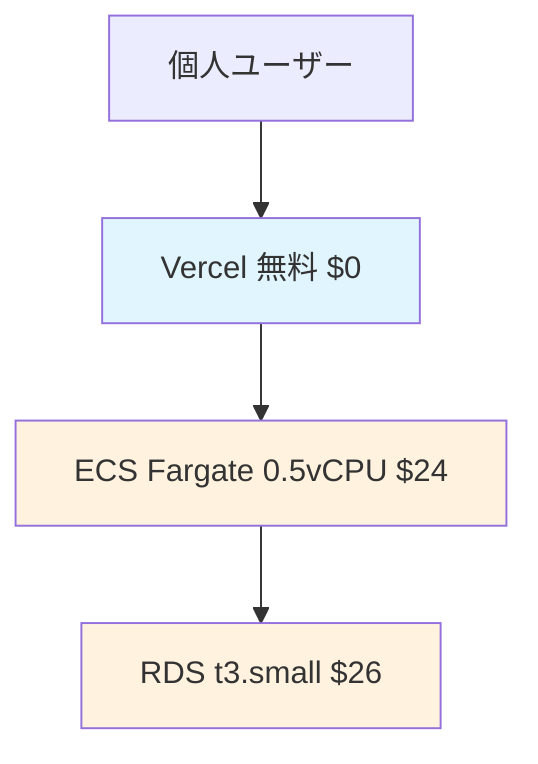
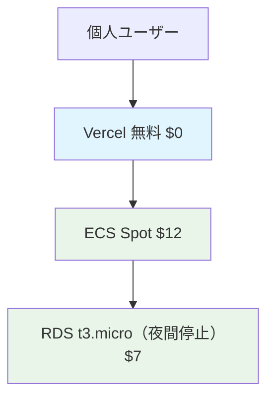

# Fusen アプリケーション 個人向けコスト最適化計画

## 💰 個人利用コスト戦略

### 🚀 個人MVP段階（月額 $25-30）
**目標**: ポートフォリオ・個人利用で最小コストを実現

#### Vercel（フロントエンド）
- **Hobby Plan**: $0
  - 100GB 帯域幅
  - 自動HTTPS
  - Git 統合
  - カスタムドメイン対応

#### AWS（バックエンド）- 超シンプル構成
| サービス | 構成 | 月額料金 |
|----------|------|----------|
| **ECS Fargate** | 0.25 vCPU, 0.5GB RAM | $12 |
| **RDS MySQL** | db.t3.micro, Single-AZ | $13 |
| **ECR** | 0.5GB | $0.05 |
| **CloudWatch** | 基本ログのみ | $2 |
| **データ転送** | 3GB/月 | $0.3 |

**AWS合計**: 約 $27/月
**総合計**: 約 $27/月（約4,000円/月）

### 📈 トラフィック増加段階（月額 $40-50）
**目標**: パフォーマンス向上（個人利用範囲内）

#### Vercel
- **Hobby Plan**: $0（継続利用）
  - 個人利用には十分
  - 帯域幅制限に注意

#### AWS - パフォーマンス向上構成
| サービス | 構成 | 月額料金 |
|----------|------|----------|
| **ECS Fargate** | 0.5 vCPU, 1GB RAM | $24 |
| **RDS MySQL** | db.t3.small, Single-AZ | $26 |
| **ECR** | 1GB | $0.1 |
| **CloudWatch** | ログ・メトリクス | $3 |
| **データ転送** | 10GB/月 | $1 |

**AWS合計**: 約 $54/月
**総合計**: 約 $54/月（約8,000円/月）

### 🎯 個人利用最適化版（月額 $20-25）
**目標**: 個人利用での究極のコスト最適化

#### 主要な最適化施策

##### 1. ECS Fargate Spot活用
```
ECS Fargate Spot Instance
- 通常: $24/月
- Spot: $12/月 (約50%削減)
```

##### 2. RDS最適化
```
使用頻度に応じた自動停止
- 夜間停止（12時間/日）: 約50%削減
- 週末停止を追加: さらに20%削減
```

##### 3. CloudWatch最適化
```
ログ保持期間調整
- デフォルト: 無期限
- 3日保持: $1/月未満に削減
```

##### 4. データ転送最適化
```
画像・静的ファイルはVercel側で配信
- AWS データ転送: $1/月 → $0.1/月
```

**最適化後総コスト: 約 $20/月（約3,000円/月）**

### 🏗️ 個人向けアーキテクチャ別コスト比較

#### Option A: 個人MVP構成（推奨）

**月額**: $27（約4,000円/月）

#### Option B: パフォーマンス向上版

**月額**: $54（約8,000円/月）

#### Option C: 最適化構成（究極節約）

**月額**: $20（約3,000円/月）

## 📊 個人利用段階的移行計画

### Phase 1: 個人MVP（0-3ヶ月）
```yaml
目標: $30/月以下
構成:
  - Vercel Hobby ($0)
  - ECS Fargate 最小 ($12)
  - RDS t3.micro Single-AZ ($13)
  - CloudWatch基本 ($2)
合計: $27/月（約4,000円/月）
```

### Phase 2: 使用量増加対応（3-6ヶ月）
```yaml
目標: $55/月以下
スケールアップ:
  - ECS 0.5vCPU, 1GB (+$12)
  - RDS t3.small (+$13)
  - 監視強化 (+$1)
合計: $54/月（約8,000円/月）
```

### Phase 3: 最適化（6ヶ月以降）
```yaml
目標: $25/月以下
最適化:
  - ECS Spot Instance (-$12)
  - RDS夜間停止 (-$6)
  - CloudWatch最適化 (-$1)
合計: $20/月（約3,000円/月）
```

## 🎯 個人向けコスト監視・アラート設定

### 1. AWS Budgets設定（個人用）
```yaml
Budget Name: "Fusen-Personal-Budget"
Amount: $35 （月額4,000円想定）
Alerts:
  - 50%使用時（$17.5）: Email Alert
  - 80%使用時（$28）: Email Alert（緊急）
  - 100%使用時（$35）: 使用停止検討
  - 120%使用時（$42）: サービス緊急停止
```

### 2. Cost Explorer活用
- 日次コスト追跡
- サービス別コスト分析
- 月次レポート自動生成

### 3. タグベースコスト管理
```yaml
Tags:
  Environment: production/staging
  Project: fusen
  Owner: team-name
  CostCenter: development
```

## 🚨 コスト削減緊急対応

### 高コスト要因と対処法

#### 1. データ転送料金急増
**原因**: API大量アクセス、画像配信など
**対処法**:
- CloudFront導入
- API Rate Limiting
- 画像最適化

#### 2. RDS料金急増  
**原因**: インスタンスサイズ、ストレージ増加
**対処法**:
- インスタンスサイズ見直し
- ストレージ自動拡張設定調整
- 古いバックアップ削除

#### 3. ECS料金急増
**原因**: タスク数増加、リソース過大
**対処法**:
- Auto Scaling設定見直し
- リソース使用率監視
- Spot Instance活用

## 💡 無料枠・クレジット活用

### AWS Free Tier（12ヶ月）
- **RDS**: db.t3.micro 750時間/月
- **ECS**: Fargate 無料枠なし
- **ALB**: 750時間/月
- **CloudWatch**: 10GB ログ、基本メトリクス

### スタートアップ支援
- **AWS Activate**: 最大$100,000クレジット
- **GitHub Student Pack**: 各種無料クレジット
- **Vercel**: 学生・OSS割引

## 📈 個人利用でのROI・価値

### ポートフォリオ価値
```
個人のスキルアップ・キャリア価値:
- AWS/Dockerスキル習得
- 本格的なポートフォリオサイト
- 面接でのアピール材料
- 月額4,000円で得られる学習価値は大きい
```

### 学習コスト効率
```
従来の学習コスト比較:
- AWS研修コース: 50,000円（1回）
- 書籍・教材: 10,000円
- 実際のクラウド運用経験: プライスレス
- 月額4,000円 × 12ヶ月 = 48,000円で実践経験
```

### 長期的なコスト削減
```
個人開発における将来価値:
- サーバー管理知識不要
- スケーラビリティへの対応済み
- 他プロジェクトへの転用可能
- 副業・フリーランス案件での活用
```

---

この個人向け最適化計画により、**月額4,000円程度の低コスト**で**本格的なクラウドアプリケーション運用**が可能です。

**推奨アプローチ**: 
1. Phase 1の個人MVP構成（月額4,000円）でスタート
2. 学習・ポートフォリオとして十分活用
3. 必要に応じてパフォーマンス向上版に移行
4. 長期利用時は最適化版でコスト削減

**個人利用なら月額3,000-4,000円で本格的なクラウド経験が積める**、コストパフォーマンス重視の構成です。