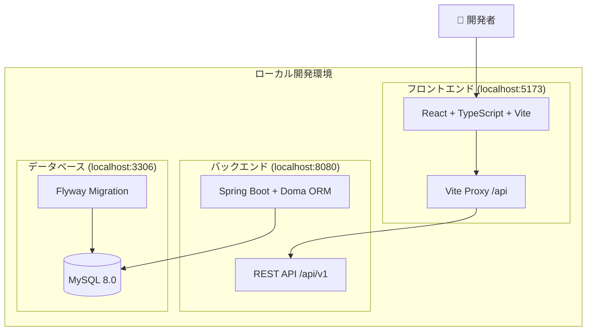
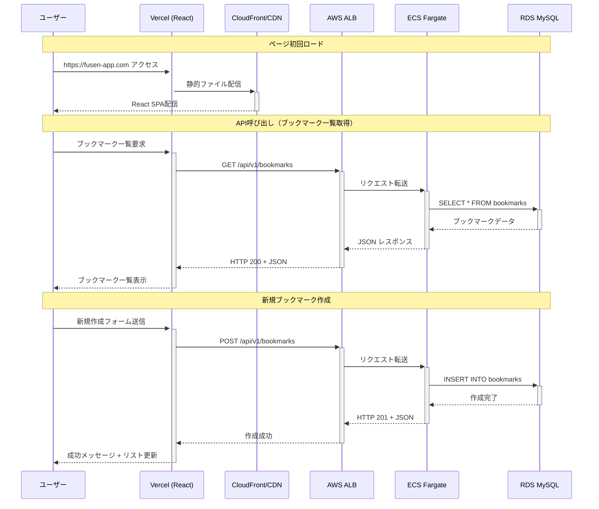
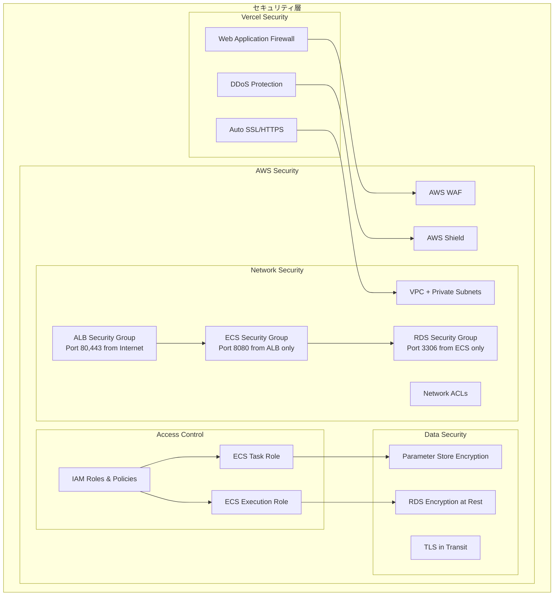
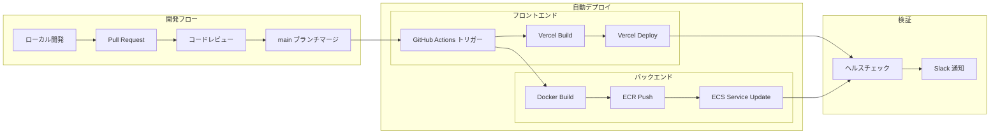

# Fusen アプリケーション システム構成図

## 1. 現在の開発環境構成



## 2. 目標：個人利用本番環境構成（Vercel + AWS）

```mermaid
graph TB
    subgraph "インターネット"
        USER[👤 個人ユーザー]
        DOMAIN_FRONT[fusen-app.vercel.app]
        DOMAIN_API[*.amazonaws.com]
    end
    
    subgraph "Vercel (フロントエンド) - 無料プラン"
        subgraph "Vercel Platform"
            VERCEL_BUILD[自動ビルド & デプロイ]
            VERCEL_APP[React SPA]
        end
    end
    
    subgraph "AWS (バックエンド) - 最小構成"
        subgraph "ECS Fargate"
            ECS_SERVICE[ECS Service]
            ECS_TASK[Spring Boot Container]
        end
        
        subgraph "RDS MySQL"
            RDS[(RDS Single-AZ)]
            RDS_BACKUP[(自動バックアップ 7日)]
        end
        
        subgraph "Security & Monitoring"
            SG[Security Groups]
            CW[CloudWatch Logs (基本)]
        end
    end
    
    subgraph "CI/CD"
        GITHUB[GitHub Repository]
        GITHUB_ACTIONS[GitHub Actions]
        ECR[Amazon ECR]
    end
    
    %% User Flow
    USER --> DOMAIN_FRONT
    USER --> DOMAIN_API
    
    %% Frontend Flow
    DOMAIN_FRONT --> VERCEL_CDN
    VERCEL_CDN --> VERCEL_APP
    GITHUB --> VERCEL_BUILD
    VERCEL_BUILD --> VERCEL_APP
    
    %% Backend Flow
    DOMAIN_API --> DNS
    DNS --> ALB
    ALB --> ECS_SERVICE
    ECS_SERVICE --> ECS_TASK1
    ECS_SERVICE --> ECS_TASK2
    ECS_TASK1 --> RDS
    ECS_TASK2 --> RDS
    
    %% API Communication
    VERCEL_APP -.->|HTTPS API Calls| ALB
    
    %% CI/CD Flow
    GITHUB --> GITHUB_ACTIONS
    GITHUB_ACTIONS --> ECR
    ECR --> ECS_SERVICE
    
    %% Security & Config
    SSM --> ECS_TASK1
    SSM --> ECS_TASK2
    SG --> ALB
    SG --> ECS_SERVICE
    SG --> RDS
    CW --> ECS_TASK1
    CW --> ECS_TASK2
    RDS --> RDS_BACKUP
```

## 3. データフロー図



## 4. セキュリティ構成



## 5. 環境別構成（個人利用）

| 環境 | フロントエンド | バックエンド | データベース | 用途 |
|------|----------------|--------------|--------------|------|
| **開発** | localhost:5173 | localhost:8080 | localhost:3306 (Docker) | ローカル開発 |
| **本番** | Vercel (無料) | AWS ECS Fargate | RDS t3.micro | 個人利用・ポートフォリオ |

**個人利用のため、ステージング環境は省略してコストを最小化**

## 6. 技術スタック詳細

### フロントエンド
- **Framework**: React 19 + TypeScript
- **Build Tool**: Vite 6.3
- **Styling**: Tailwind CSS 4.1
- **HTTP Client**: Axios
- **Routing**: React Router DOM 7.6
- **Testing**: Vitest + Testing Library

### バックエンド  
- **Framework**: Spring Boot 3.4.6
- **Language**: Java 21
- **ORM**: Doma 2.53
- **Database**: MySQL 8.0
- **Build Tool**: Maven 3.9
- **Container**: Docker + Amazon Corretto 21

### インフラストラクチャ
- **Frontend Hosting**: Vercel
- **Container Platform**: AWS ECS Fargate
- **Database**: AWS RDS MySQL
- **Load Balancer**: AWS Application Load Balancer
- **DNS**: AWS Route 53
- **CI/CD**: GitHub Actions
- **Container Registry**: Amazon ECR
- **Monitoring**: AWS CloudWatch
- **Secrets Management**: AWS Parameter Store

## 7. デプロイフロー



---

**このシステム構成図により、以下が明確になります:**

1. **開発環境から本番環境への移行計画**
2. **セキュリティ要件と実装方法**  
3. **スケーラビリティとパフォーマンス考慮点**
4. **運用・監視の仕組み**
5. **CI/CDパイプライン設計**

次のステップとして、この構成に基づいた具体的な実装作業に入りましょうか？