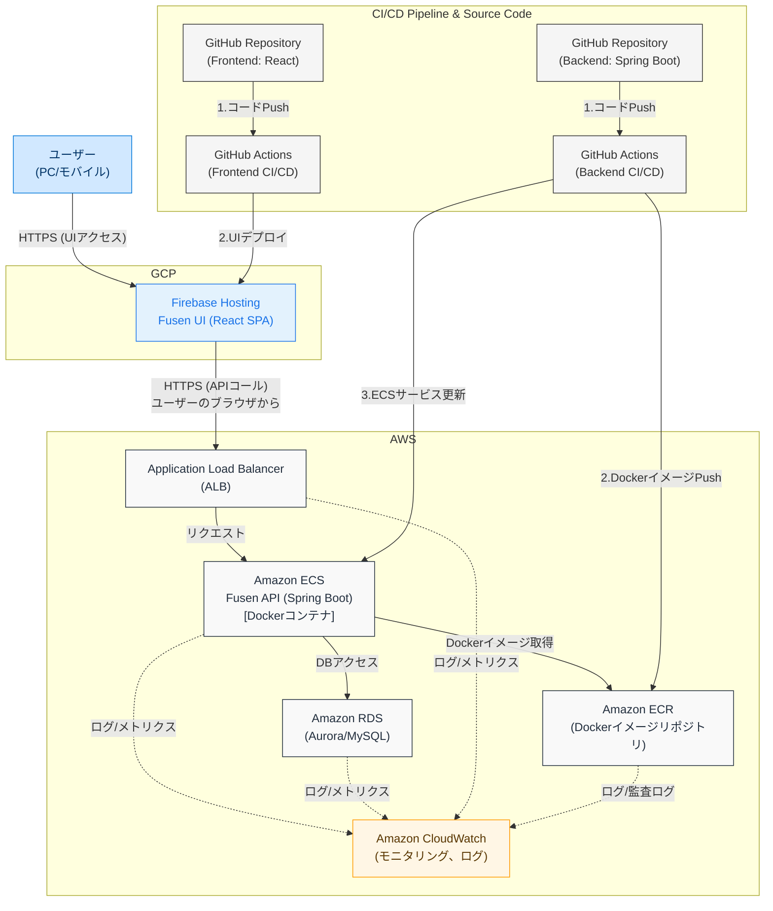

# システム構成図

```mermaid
graph TD
    %% スタイル定義 (凡例)
    %% gcpService (青系): Google Cloud Platform サービス (例: Firebase Hosting)
    %% awsService (グレー系): AWS Cloud サービス (例: ALB, ECS, RDS, ECR)
    %% githubService (濃いグレー系): GitHub 関連 (例: Repository, Actions)
    %% user (水色系): 利用者
    %% cloudMonitoring (オレンジ系): クラウド監視サービス (例: CloudWatch)
    classDef gcpService fill:#E3F2FD,stroke:#1A73E8,stroke-width:1px,color:#1A73E8
    classDef awsService fill:#f9f9f9,stroke:#232F3E,stroke-width:1px,color:#232F3E
    classDef githubService fill:#F5F5F5,stroke:#333333,stroke-width:1px,color:#333333
    classDef user fill:#D1E8FF,stroke:#0077D9,stroke-width:1px,color:#003366
    classDef cloudMonitoring fill:#FFF6E5,stroke:#FF9900,stroke-width:1px,color:#593600

    %% 利用者
    U["ユーザー<br/>(PC/モバイル)"]:::user

    %% CI/CD Pipeline
    subgraph CI_CD [CI/CD Pipeline & Source Code]
        direction TB
        GH_FE["GitHub Repository<br/>(Frontend: React)"]:::githubService
        GHA_FE["GitHub Actions<br/>(Frontend CI/CD)"]:::githubService
        GH_BE["GitHub Repository<br/>(Backend: Spring Boot)"]:::githubService
        GHA_BE["GitHub Actions<br/>(Backend CI/CD)"]:::githubService

        GH_FE -- "1.コードPush" --> GHA_FE
        GH_BE -- "1.コードPush" --> GHA_BE
    end

    %% GCP Cloud (Frontend)
    subgraph GCP
        direction LR
        FB_UI["Firebase Hosting<br/>Fusen UI (React SPA)"]:::gcpService
    end

    %% AWS Cloud (Backend)
    subgraph AWS
        direction LR
        ALB["Application Load Balancer<br/>(ALB)"]:::awsService
        ECS["Amazon ECS<br/>Fusen API (Spring Boot)<br/>[Dockerコンテナ]"]:::awsService
        ECR["Amazon ECR<br/>(Dockerイメージリポジトリ)"]:::awsService
        RDS["Amazon RDS<br/>(Aurora/MySQL)"]:::awsService
        CW["Amazon CloudWatch<br/>(モニタリング、ログ)"]:::cloudMonitoring
    end

    %% User Flow
    U -- "HTTPS (UIアクセス)" --> FB_UI

    %% Frontend to Backend API Call (from User's Browser)
    FB_UI -- "HTTPS (APIコール)<br/>ユーザーのブラウザから" --> ALB

    %% Backend Internal Flow (AWS)
    ALB -- "リクエスト" --> ECS
    ECS -- "DBアクセス" --> RDS
    ECS -- "Dockerイメージ取得" --> ECR


    %% CI/CD Deployments
    GHA_FE -- "2.UIデプロイ" --> FB_UI
    GHA_BE -- "2.DockerイメージPush" --> ECR
    GHA_BE -- "3.ECSサービス更新" --> ECS


    %% Monitoring Connections (AWS)
    ECS -. "ログ/メトリクス" .-> CW
    RDS -. "ログ/メトリクス" .-> CW
    ALB -. "ログ/メトリクス" .-> CW
    ECR -. "ログ/監査ログ" .-> CW
```
