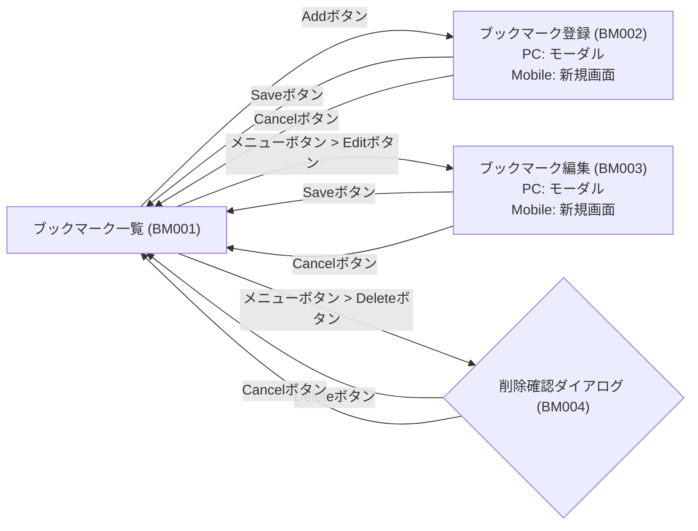

# 画面遷移図

```mermaid
graph LR
    %% 画面ノード定義
    BM001["ブックマーク一覧 (BM001)"]
    BM002["ブックマーク登録 (BM002) <br> PC: モーダル<br> Mobile: 新規画面"]
    BM003["ブックマーク編集 (BM003) <br> PC: モーダル<br> Mobile: 新規画面"]
    BM004{"削除確認ダイアログ (BM004)"}

    %% 遷移定義
    BM001 -->|"Addボタン"| BM002
    BM001 -->|"メニューボタン > Editボタン"| BM003
    BM001 -->|"メニューボタン > Deleteボタン"| BM004

    BM002 -->|"Saveボタン"| BM001
    BM002 -->|"Cancelボタン"| BM001

    BM003 -->|"Saveボタン"| BM001
    BM003 -->|"Cancelボタン"| BM001

    BM004 -->|"Deleteボタン"| BM001
    BM004 -->|"Cancelボタン"| BM001
```
